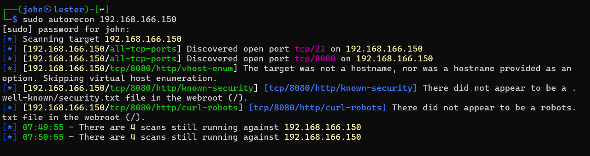

# OSCP-B Walkthrough

## ActiveDirectory

## Standalone

<a id="#150">.150</a>

## .150(#150)

<div id=150></div>

My friends have seen my OSCP-A walkthrough and told me I'm wasting time running my nmap scans on the OSCP. I've been in this industry for years and I'm being told not to use nmap. What is the world coming to?

Apparently it's come to <a href="https://github.com/Tib3rius/AutoRecon">autorecon</a>.

Rumour has that autorecon is built for the OSCP and that it makes life 100x easier. So autorecon it is.

```sudo autorecon 192.168.166.150```

<b>Note:</b> It's really important to run autorecon as root, otherwise it wont check UDP (<i>foreshadowing</i>)

<br>

Autorecon found ports 22 and 8080. It uses this sensible (but slightly tedius to navigate) folder structure:

<br>

Taking a look at port 22, there doesn't appear to be anything remarkable. This will probably be used for priv esc.

<figure>
  <br>
  <figcaption>I won't make you read every scan output just trust me</figcaption>
</figure><br>

Taking a look at the port 8080 feroxbuster, there are some interesting endpoints:

<br>

Let's pull them up (I'm one of those losers that uses a browser. Sorry I can't be a cool linux commandline hacker like you)

<br>

Okay there's an API, cool.

<br>

I've done enough boxes to know that this is by design. `Apache Commons Text 1.8`  Either a rabbit hole or the vuln, lets find out.

Google for that version:

<br>

Yeah that'll do it... And the changelog also mentioned this library is for `string interpolation` which probably means it's utilised in our `/search` page.

<br>

If you know what the parameters for an API request are, try giving it some...

<br>

Okay so we can't give it a result but we can sure give it a query. Let's look into text4shell.

I didn't like the look of that first repo, so I googled `text4shell github poc` and got <a href="https://github.com/808ale/CVE-2022-42889-Text4Shell-POC">this one</a>.

Running it, we get something like this:

<br>

So text4shell abuses the way these specific libraries parse strings and allows for this code exec using Java's .getRuntime.exec(). I didn't get any results from the `whoami`, so maybe we won't get any output at all?

As this is a walkthrough and not a "how I bashed my head against my keyboard really hard until it worked", I'll explain what happened.

This is a blind RCE, so we don't get any feedback from the API, but our commands <i>are being executed</i>. That is, if they're encoded. 

After some troubleshooting, I found that many POCs for text4shell always URL encode all of the characters.